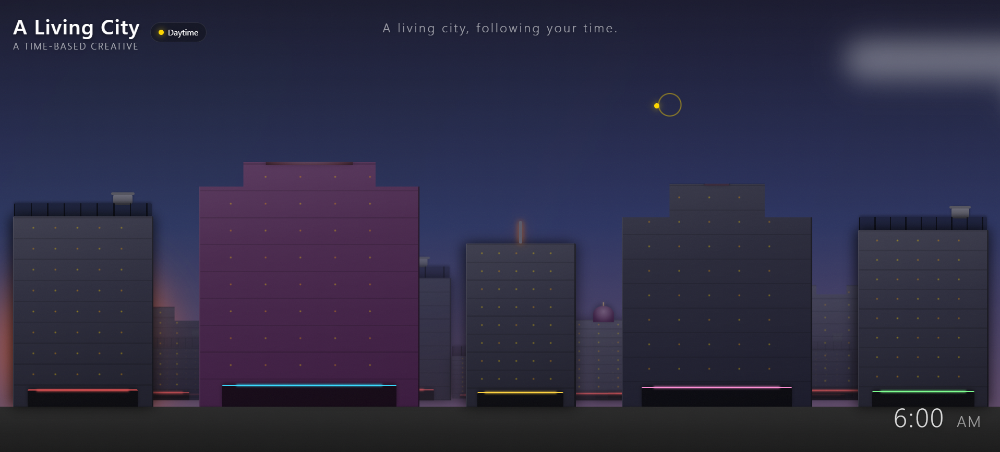
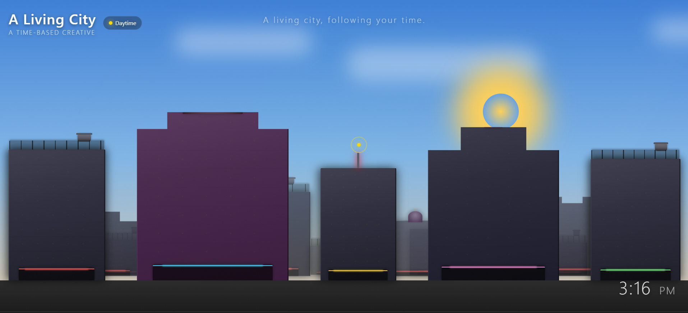
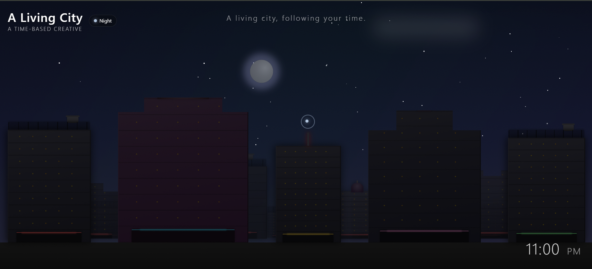

# A Living City — Time-Based Creative

A self-contained web creative that transforms continuously based on the visitor's local device time. Built with plain HTML, CSS, and JavaScript only — no frameworks, no libraries, no build tools.

##  Concept

The scene is a city skyline that feels alive throughout the day. As the real time changes, every element — sky, sun, moon, stars, clouds, buildings, and windows — transitions smoothly to match the moment. The city responds to the visitor's own clock, never requiring any interaction.

##  Features

- **Continuous day-night cycle** — no hard scene switching; all properties interpolate gently.
- **Sun arc** — sun rises in the east, peaks at noon, and sets in the west with natural color changes.
- **Moon and stars** — gradually appear after sunset and fade at dawn.
- **Living buildings** — irregular window lights, architectural variety (flat, temple, church, dome, tower, skyscraper).
- **Golden Hour moment** (6:00 PM – 6:30 PM) — a special window where the sun glows intensely and a flock of birds flies across the sky.
- **Custom cursor** — time-aware color and glow, hides after 5 seconds of inactivity.
- **Responsive** — works beautifully on both laptop and mobile.

##  Approach

The core is a **time engine** that converts the visitor's local time into a continuous value (minutes since midnight, including seconds). This value is then mapped through a series of keyframes:

- Sky colors are interpolated between predefined keyframes (e.g., 5 AM dark blue → 7 AM bright blue → 6 PM orange → 12 AM deep navy).
- Sun position and color follow keyframe interpolation as well, moving along an arc.
- Moon position is calculated with a wrap-around to handle midnight correctly.
- Stars, clouds, windows, and building brightness all use smooth interpolation functions (`lerp`, `lerpColor`).

Everything is driven by CSS variables that the JavaScript updates every second, giving a seamless, continuous transition.

##  Correctness at Any Moment

- On page load, `updateScene()` is called immediately before any interval. This ensures the initial view matches the current time with no warm-up.
- Time is read directly from `Date` — always the visitor's actual device time.
- The keyframe interpolation handles midnight wrap-around, so 1 AM does not break the logic.
- No manual input or user action is needed.

##  Assumptions

- **Special moment**: I chose Golden Hour (6:00–6:30 PM) as the short, unique event. It felt natural — not just decorative — because it intensifies the sunset with birds crossing the sky.
- **Theme**: A city skyline was chosen because it offers the most visually rich way to show time change through multiple elements (sky, sun, moon, stars, buildings, windows).
- **System theme**: I intentionally did not let the OS dark mode override the real time. The scene always reflects the actual time of day; system theme only subtly modifies brightness for comfort.
- **Time accuracy**: The code assumes the visitor's device clock is correct.

##  Running

Simply open `index.html` in any modern browser. No server, no build step required.

##  Testing

To test different times without waiting, open the browser console and paste:

```javascript
const fakeTime = new Date();
fakeTime.setHours(23, 0, 0, 0); // change to desired time
const RealDate = Date;
Date = class extends RealDate {
    constructor(...args) { if (args.length === 0) super(fakeTime.getTime()); else super(...args); }
    static now() { return fakeTime.getTime(); }
};
updateScene();

##  Screenshots

| Morning | Golden Hour | Night |
|---------|-------------|-------|
|  |  |  |